Boston Airbnb Listings Analysis Report
================
Fall Foliage

- [Introduction](#introduction)
- [Dataset](#dataset)
- [Further Analysis](#further-analysis)
  - [1. Host Analysis](#1-host-analysis)
  - [2. Property Analysis](#2-property-analysis)
  - [3. Price and Revenue Analysis](#3-price-and-revenue-analysis)
  - [3.3 Revenue Landscape](#33-revenue-landscape)
  - [3.4 Geographic Performance by Price and
    Revenue](#34-geographic-performance-by-price-and-revenue)
  - [3.5 Pricing Strategy Analysis](#35-pricing-strategy-analysis)
  - [3.6 Operational Optimization](#36-operational-optimization)
  - [3.7 Host Development Insights](#37-host-development-insights)
- [Modeling: Clustering](#modeling-clustering)
- [Results and Recommendations](#results-and-recommendations)
- [Team Contributions](#team-contributions)

## Introduction

The short-term rental market plays an important role in urban tourism,
and Airbnb has a significant influence on housing and travel patterns in
cities like Boston. With many listings competing for attention, this
project asks a central question: what makes an Airbnb listing successful
in Boston, and what can hosts or prospective hosts do to make their
listings more successful?

To explore this, we analyzed how listing characteristics, such as room
and property type, neighbourhood, amenities, and availability, relate to
price and revenue. We also examined host behavior, including experience,
portfolio size, and host longevity, to understand how different hosting
strategies affect performance. Finally, we used clustering methods to
assess whether Boston’s Airbnb market segments into distinct groups with
similar features and revenue profiles.

Together, these analyses provide insight into the factors shaping
listing performance, host participation, and broader trends in Boston’s
short-term rental market.

## Dataset

The primary dataset for this project is the open-source
listings_detailed.csv from Airbnb, which contains 4,419 Boston-area
listings as of September 2025 and includes 79 variables describing
hosts, reviews, and listing characteristics.

The main dataset for the project is the open source
listings_detailed.csv from the Airbnb website. It contains Boston, MA
area listings as of September, 2025. There are 4,419 observations and 79
variables describing hosts, reviews and detailed characteristics of the
listings. The initial examination of the variable types and statistics
revealed that the empty values were encoded as empty strings, “NA”,
“N/A”, or “null”. For consistency the aforementioned were standardized
to NA after the import. There were several columns with a high
percentage of missing values, including variables related to reviews and
ratings. Further standardization was needed for columns that had numeric
values accompanied with symbols, such as price values containing dollar
character signs (\$). The statistics also showed the widespread
behaviour of the accommodation characteristic values ranging from 0 to
15 for bedrooms and the price of listings reaching to \$50.000. Overall,
this step underscored the importance of detailed preprocessing,
revealing that for an apparently clean dataset there is still a need to
ensure accuracy and reliability.

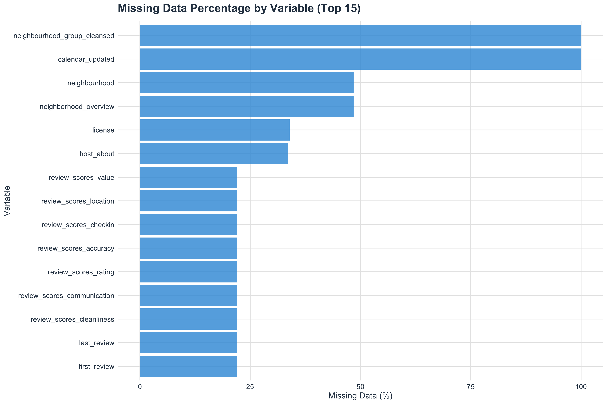

The missing-data analysis showed that 42 out of 79 variables contained
missing values. The key variables price, review_scores\_, first_review,
last_review contained nearly 20% missingness.

After removing currency symbols and commas from the price variable, we
converted it to a numeric format. To define meaningful price segments,
we examined the empirical distribution of nightly rates using sample
quantiles. The 20th, 40th, 60th, 80th, and 90th percentiles were
approximately 103, 170, 247, 347, and 472 dollars. This confirmed a
right-skewed distribution with a small number of listings priced far
above the rest, including a maximum nightly rate of 50,000 dollars.
Based on these quantiles, we created five price categories: Budget
(below 100), Economy (100 to 169.99), Mid-range (170 to 249.99), Premium
(250 to 349.99), and Luxury (350 and above). We attempted a 0.5 percent
tail-trimming procedure to see if extreme values were data errors, but
this resulted in no excluded observations. This outcome suggested that
the unusually high prices were genuine listings rather than numerical
mistakes, so we kept them in our analysis and clustering.

Several host-related variables also required standardization. Percentage
strings such as “100 percent” were converted to numeric proportions. A
binary superhost indicator was created, but it was ultimately not
included in the clustering because almost all observations were coded as
either FALSE or missing. We constructed duration-based metrics from the
available date fields, including host experience in years (calculated
from the difference between host_since and last_scraped), days since
first review, and days since last review.

Amenities were provided as a long text string, so we transformed this
field into more usable formats. We first computed amenity count by
counting comma-separated items. We then created binary indicators for
key amenities such as WiFi, kitchen access, heating, air conditioning,
parking, washer, dryer, TV, workspace, and gym access. These indicators
were combined into a premium amenity score that reflected how
feature-rich each listing was. On average, listings offered 34.6
amenities. WiFi appeared in 99 percent of listings and kitchen access
appeared in 87 percent, which made both amenities nearly universal.

To support performance-based clustering, we engineered several revenue
and occupancy metrics. Annual revenue was taken from Airbnb’s estimated
revenue when available, and otherwise approximated using price and
availability. We also created revenue per bed, revenue per bedroom,
price per person, and an efficiency index that captured revenue relative
to price. Occupancy rate was standardized to lie between zero and one. A
composite review activity score was created to combine review frequency
with rating quality. Missing values for behavioral measures such as
reviews per month were coded as zero to represent no recent review
activity rather than missing data.

The neighbourhood_group_cleansed variable was fully missing in our
dataset, so we recreated it from neighbourhood_cleansed to enable
group-level summaries. We also loaded Boston neighborhood boundaries
from a GeoJSON file to support spatial visualization, geospatial joins,
and neighborhood-level comparisons in later sections. These cleaning and
engineering steps resulted in a comprehensive, multi-dimensional dataset
that allowed us to study listing performance from both a property
perspective and a host perspective.

## Further Analysis

### 1. Host Analysis

#### 1.1. Superhosts vs. Regular Hosts Performance

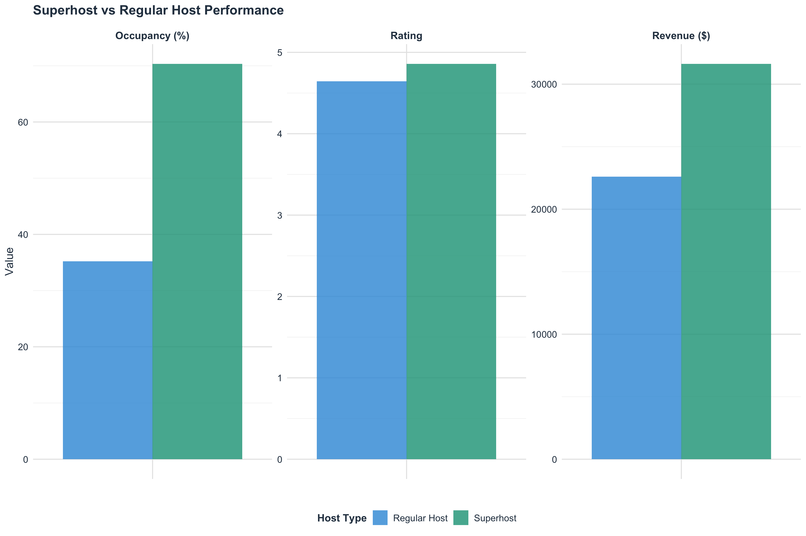

This comparison highlights clear differences in performance between
Superhosts and regular hosts across multiple dimensions. Superhosts
exhibit substantially higher occupancy rates, slightly higher average
ratings, and notably higher annual revenue Together, these patterns
suggest that host reliability and quality—captured by Superhost
status—are strongly associated with improved listing performance.

#### 1.2 Average Revenue by Host Response Rate

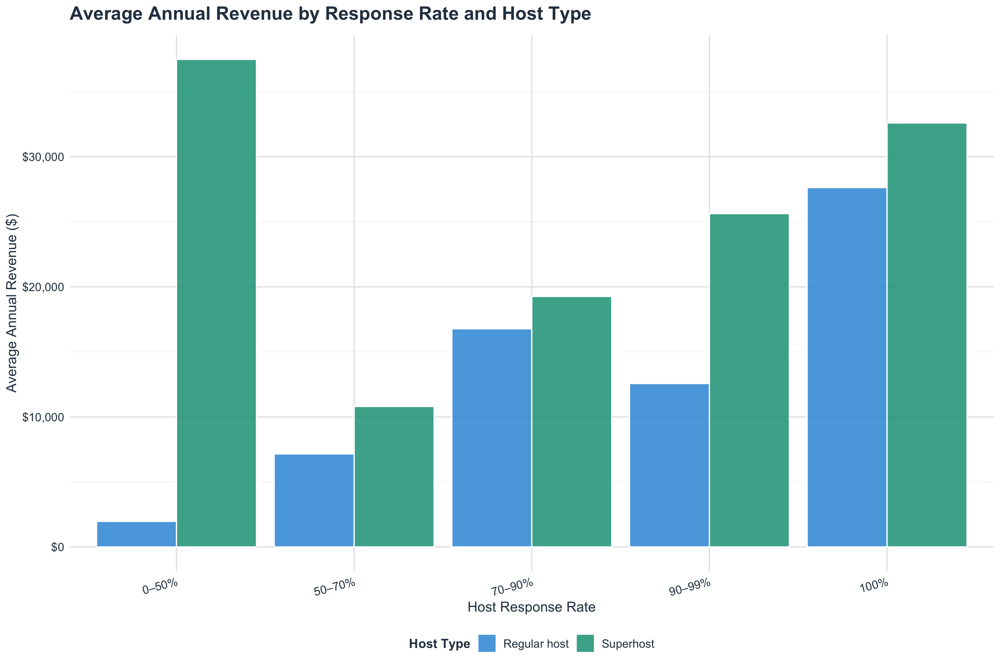

Average annual revenue increases with host response rate for both
Superhosts and regular hosts. This relationship emphasizes the
importance of timely communication in securing bookings and maximizing
revenue. While Superhosts earn more than regular hosts at every response
rate level, the gap is particularly large at high response rates. An
outlier appears among Superhosts with very low response rates (0–50
percent), who still generate unusually high revenue. This likely
reflects a small number of exceptional or professionally managed
listings rather than a general pattern, reinforcing that high response
rates are an important driver of performance for most hosts.

#### 1.3 Average Revenue by Host Portfolio

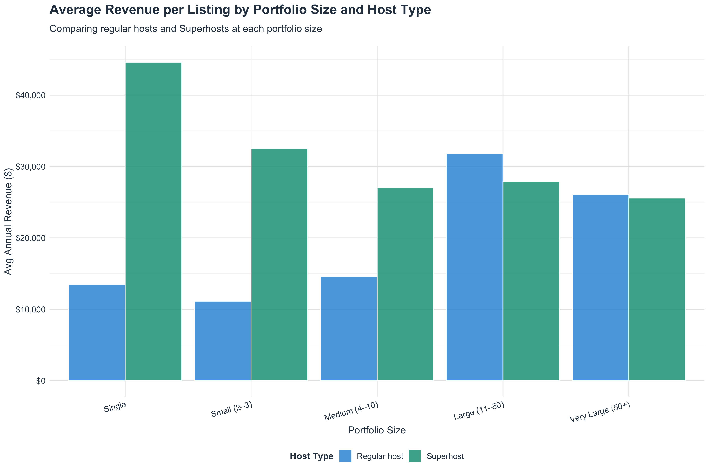

Revenue per listing does not have a positive relationship with host
portfolio size. Instead, Superhosts with smaller portfolios earn the
highest revenue per listing, while revenue per listing declines as
portfolio size grows. This suggests diminishing returns to scale, where
managing a larger number of properties may reduce the ability to
maintain high performance at the individual listing level. Regular hosts
display a similar pattern, with revenue per listing peaking at moderate
portfolio sizes before declining. These results indicate that focusing
on a smaller, more manageable set of listings may be more profitable on
a per-listing basis than expanding.

#### 1.4 Annual Revenue Time Series by Host Experience

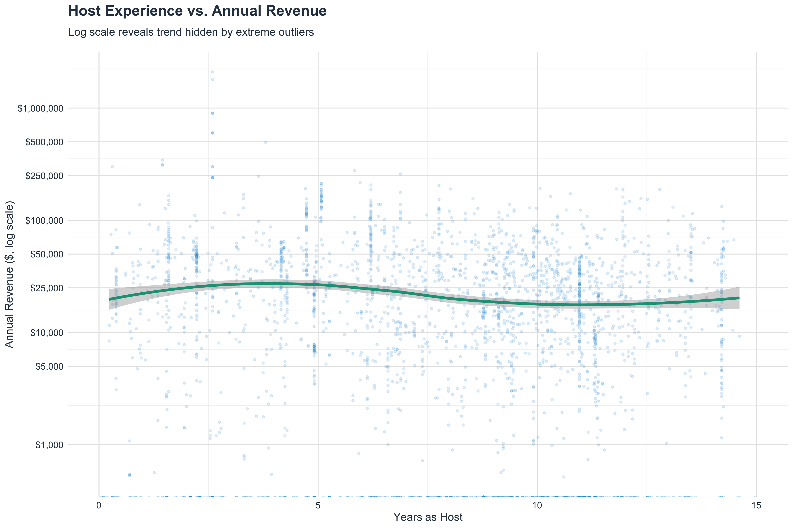

Annual revenue remains relatively stable across different levels of host
experience. Hosts who have recently joined the platform earn comparable
revenue to those who have been hosting for many years, suggesting that
experience alone does not guarantee higher earnings. This finding
implies that success on Airbnb depends more on current listing
attributes, pricing, and host behavior than on tenure. In other words,
newer hosts are able to compete effectively with more experienced hosts
if they adopt effective strategies early on.

### 2. Property Analysis

When analyzing Airbnb listings, an important focus is the properties
themselves. In this section, we examine the listings by analyzing
features such as property type, room type, and location (which
neighbourhood in Boston the listing is located in). The goal of this
section is to identify trends in the types and locations of spaces hosts
list in Boston and provide insights for prospective hosts considering
the area.

#### 2.1. Room and Property Type Analysis

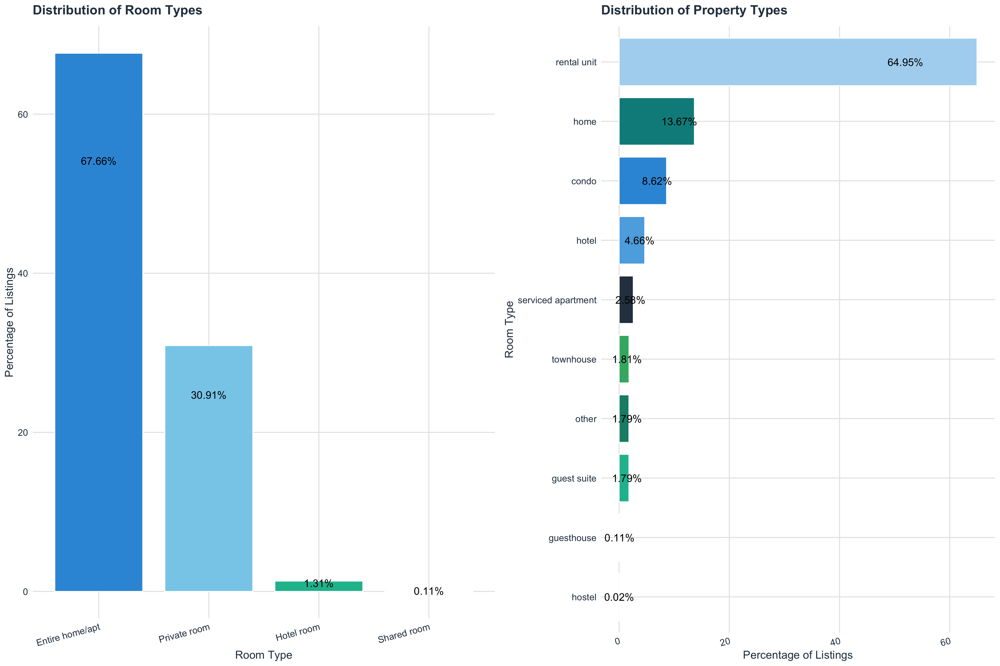

First, we analyzed the distribution of room types, which includes entire
homes or apartments, private rooms, hotel rooms, and shared rooms. As
expected, the most common room type is an entire home or apartment,
accounting for 67.66% of listings, followed by private rooms at 30.91%.
Hotel room listings are rare, which aligns with the fact that travelers
can book hotels directly. Shared rooms are even less common, likely
because guests generally prefer not to share spaces with strangers.

Next, we analyzed the distribution of property types, which indicates
whether a listing is a rental unit, home, condo, serviced apartment,
etc. Before doing so, we simplified the property_type column.
Originally, it included values like “entire rental unit,” “private room
in rental unit,” or “private room in home.” To focus solely on the
property type rather than the combination of room and property, we used
the str_detect method to identify the main property types and replaced
the original values with these simplified categories (e.g., “rental
unit,” “home”).

After cleaning the data, we created a bar chart to visualize the
distribution of property types. We found that “rental unit” accounted
for the largest share of listings at 64.95%, followed by “home” at
13.67%. This suggests that hosts may prefer listing rental units because
they are more cost-effective and easier to maintain than homes,
particularly in urban areas like Boston.

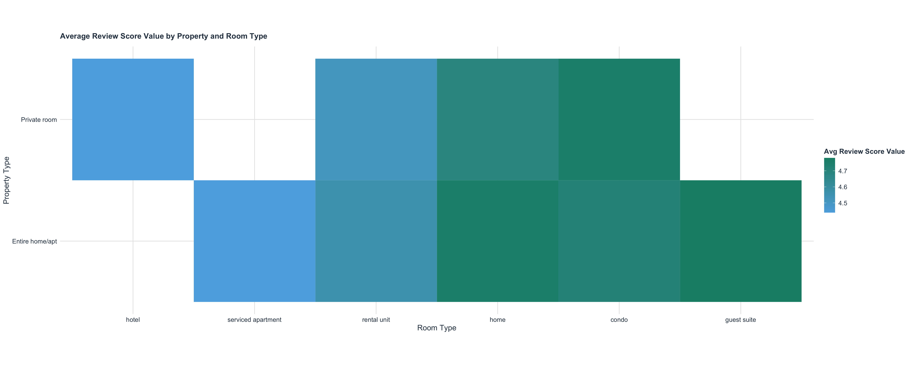

To get a better sense of how different property characteristics affect
guest experience, we looked at how room type and property type work
together and how that relates to guest satisfaction. We used the
review_scores_value variable, which basically measures how well guests
felt the listing matched the price they paid (on a scale of 0 to 5, with
5 being the best). We plotted these relationships in a heat map, where
each tile shows the average value score for a specific room–property
type combination. Even though the scores only range from about 4.4 to
4.8, those small differences matter on Airbnb; tenths of a point can
affect how often a listing shows up in search results and whether guests
choose it over similar options.

From the heat map, “entire condos” consistently came out with the
highest average value scores, meaning guests feel they are getting
really good quality for the price.

Looking at room and property types overall helps us understand both how
hosts are currently setting up their listings and what guests respond
the most to. For example, the popularity of entire homes and rental
units suggests that guests prefer privacy, and these types of properties
are probably easier for hosts to manage. At the same time, the
value-score patterns show that some combinations, like entire condos,
may give hosts an advantage because they naturally deliver higher
perceived value.

Overall, these insights can help new hosts understand which property
types are not only popular in Boston but also earn higher satisfaction
scores, giving them a clearer sense of how to set up their listings to
stay competitive.

#### 2.2. Property Location Distribution

This section focuses on the location of properties, specifically which
neighbourhoods in Boston are most commonly listed compared to which
neighbourhoods have more guest engagement or satisfaction.

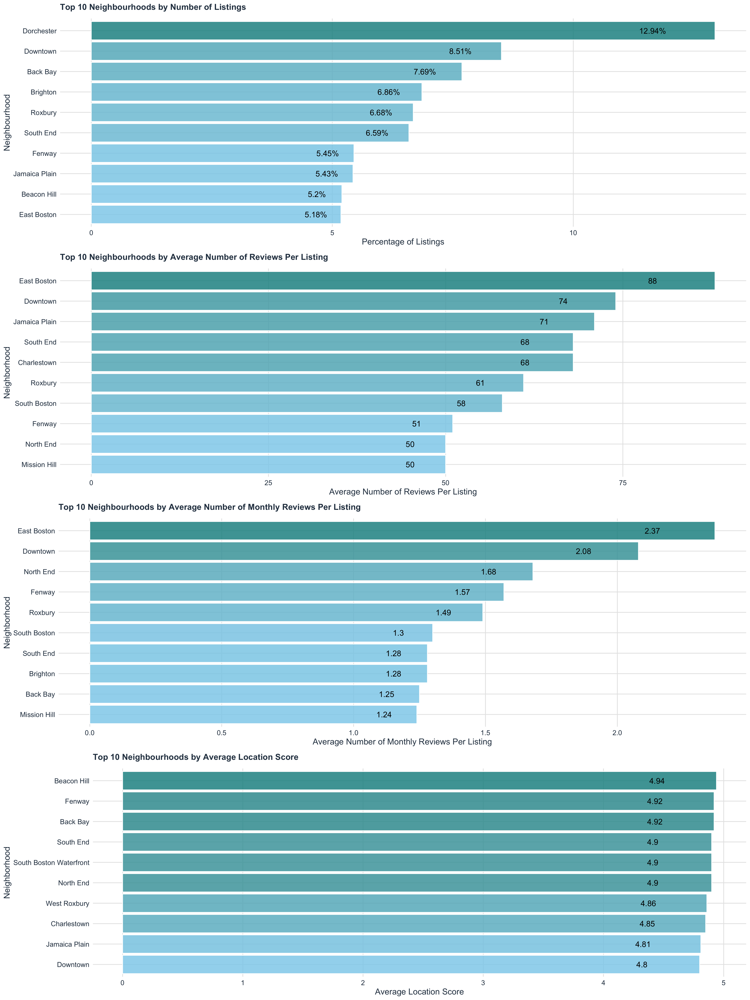

For the first horizontal bar chart, we plotted the top 10 neighbourhoods
by number of listings. This showed that Dorchester is the most commonly
listed location, making up 12.94% of all listings.

The next two graphs look at guest engagement by showing the top 10
neighbourhoods ranked by average number of reviews per listing and
average monthly reviews per listing. We used total reviews and monthly
reviews as a proxy for engagement, since more reviews typically indicate
that guests are actually staying there. Across both graphs, East Boston
stands out with the highest engagement with about 88 reviews per listing
and 2.37 monthly reviews. Downtown follows with around 74 reviews per
listing and 2.08 monthly reviews. This makes sense: East Boston is home
to Logan Airport, so it naturally attracts travelers looking for quick
access. Downtown is a major tourist hub, so high turnover and lots of
reviews also track logically.

Based on these three graphs, I would suggest that prospective hosts
avoid listing in Dorchester and instead look toward East Boston or
Downtown Boston. Even though Dorchester has the highest number of
listings, it doesn’t show up in the top 10 for guest engagement. That
suggests the market there is saturated meaning it has lots of listings
but not as many guests staying and leaving reviews which could make it
harder for new listings to stand out. In contrast, East Boston and
Downtown have both demand and engagement, which could lead to higher
visibility and better returns for hosts.

We also created a bar chart focusing on the top 10 neighbourhoods by
average location score (how much guests like the location of the
property itself, ranging from 0 to 5). Beacon Hill came out on top with
4.94. Since guests often filter for or prioritize “great location” when
choosing a place to stay, this makes Beacon Hill an especially strong
area for potential hosts. Downtown also ranked highly with a score of
4.8, reinforcing once again that listing in Downtown is a smart move to
attract guests, generate more engagement, and ultimately increase
profitability.

#### 2.3. Property Type and Amenities

In this section, 23 looked at how many amenities different property
types typically offer and how those amenities relate to their average
review score value.

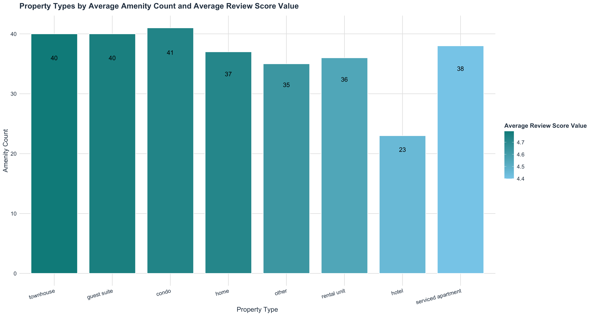

To explore this, we created a bar chart showing the average number of
amenities for each property type and ordered the bars by average review
score value. At a quick glance, property types with more amenities, such
as townhouses and guest suites, also tend to have higher review score
values. On the other hand, property types with fewer amenities, such as
hotels, score lower on average.

The goal here was simply to see whether certain property types
consistently offer more amenities and whether that correlates with
higher guest satisfaction. Since higher review score values can help
attract more guests, this suggests that prospective hosts may benefit
from listing property types that naturally come with more amenities,
like townhouses, because they could lead to better guest experiences and
stronger ratings.

### 3. Price and Revenue Analysis

#### 3.1. Univariate Analysis - Price Distribution

To understand the underlying pricing behaviour of Boston Airbnb
listings, we did an exploratory analysis with three interconnected
visualizations: a histogram of nightly rates, a violin plot of price
density, and a categorical distribution of price tiers.

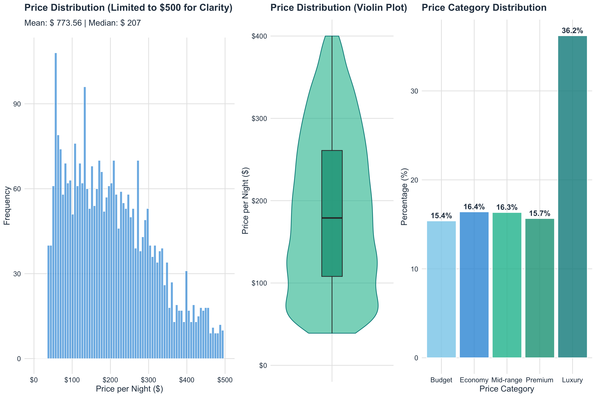

The distribution of nightly prices reveals substantial variation across
Boston Airbnb listings. As shown in the accompanying visualizations,
prices below \$500 dominate the dataset, yet the overall distribution is
**strongly right-skewed**. The **mean nightly rate is \$773.56**, while
the **median is much lower at \$207**, indicating that a small number of
extremely expensive stays raise the average considerably.

The **violin plot** highlights this pattern more clearly: most listings
fall within a narrow central band (approximately \$75–\$300), while the
extended upper tail corresponds to high-priced luxury units. These
extreme prices are **valid observations**, not anomalies, as no listings
were removed by the 0.5% outlier-trimming rule applied during data
cleaning.

To further contextualize price levels, listings were grouped into five
categories—**Budget**, **Economy**, **Mid-range**, **Premium**, and
**Luxury**. The resulting distribution demonstrates a **diverse pricing
structure**, with the **Luxury segment representing the largest share
(32.7%)** of the market. Mid-range and Premium categories together form
another substantial proportion, while Budget listings comprise less than
10%.

Overall, the pricing analysis suggests that Boston’s short-term rental
market is characterized by a wide variety of offerings, ranging from
affordable units to high-end luxury stays. This variability supports the
use of clustering methods in later sections, as distinct pricing tiers
likely reflect meaningful differences in property characteristics and
host strategies.

#### 3.2. Bivariate Analysis - Price vs Key Variables

##### 3.2.1. Price by Room Type

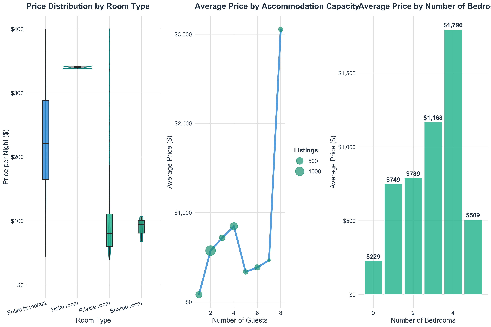

The first visualization shows clear differences in price across room
types.

**Entire homes/apartments command significantly higher prices** than
private or shared rooms, with a much wider spread extending toward the
upper end of the distribution. The violin and boxplot combination
illustrates substantial heterogeneity within this category, capturing
both budget-friendly studios and premium multi-bedroom units.

In contrast, **private rooms** exhibit a narrower distribution centered
around lower price levels, while **shared rooms** consistently remain
the most affordable segment. This pattern aligns with expected
differences in privacy, space, and amenities offered by each room type.

##### 3.2.2. Price by Accommodation Capacity

Price levels also rise with the number of guests a listing can
accommodate.

Listings for **2–4 guests show a smooth, steady increase** in average
nightly rates, reflecting the value added by additional sleeping space.
Interestingly, the trend becomes more irregular beyond 5 guests, where a
small number of **large-capacity luxury listings** cause a steep jump in
average price values, despite representing fewer total units (as
indicated by point size).

This suggests that properties designed for large groups
disproportionately belong to the high-end segment of the market,
contributing more variation than smaller-capacity listings.

##### 3.2.3. Price by Number of Bedrooms

The relationship between price and number of bedrooms is similarly
positive.

Prices **increase almost monotonically** from studios (0 bedrooms)
through 4-bedroom units, with average prices reaching over \$1,700 for
four-bedroom properties. The only exception is the small dip observed at
5 bedrooms, which is likely due to limited sample size in this category.

This pattern indicates that **bedroom count is one of the strongest
structural predictors of listing price**, reflecting both square footage
and the ability to host more guests.

Overall, the bivariate analysis reveals that:

- **Room type** strongly segments the market into budget (shared rooms),
  mid-range (private rooms), and high-value (entire homes) categories.
- **Accommodation capacity** drives prices upward, particularly for
  large-group listings, which form a small but highly priced niche.
- **Bedroom count** is closely associated with price increases,
  reinforcing its role as a key structural determinant of listing value.

### 3.3 Revenue Landscape

We hypothesize that the revenue outcomes for Airbnbs fundamentally
depends on both price and occupancy rate. To visualize, we plot a
heatmap to observe the complex interaction between price and occupancy
rates on revenue outcomes.

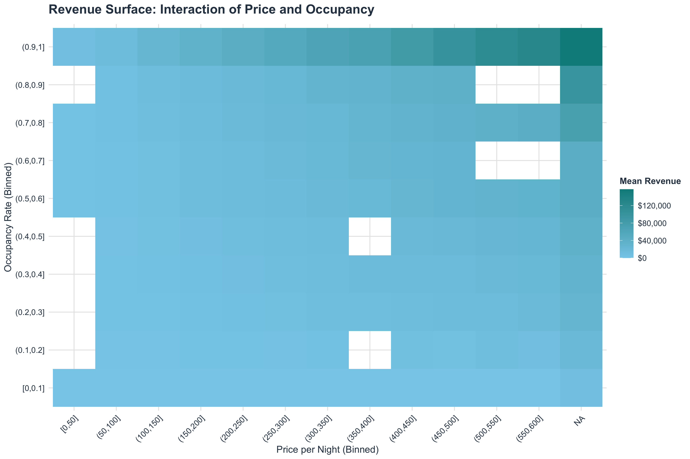

**Observations:**

- The white cells indicate data gaps that limit completeness, but the
  remaining cells are informative enough for our analysis.
- We observe that peak revenues (\$120,000+) concentrate in ***high
  occupancy (90-100%)*** across ***mid-to-high price ranges
  (\$300-\$600)***.
- The highest mean revenues occur where both price and occupancy are
  high. Some bins with high prices but mediocre occupancy do not achieve
  top revenues.
- The remaining zones shows relatively consistent revenues regardless of
  pricing or occupancy rates.

**Interpretations:** The dual optimal zones confirm two viable
strategies: high-volume moderate pricing or low-volume ultra-premium
approaches. The weak middle-occupancy performance suggests hosts stuck
between strategies ***underperform***, lacking either volume efficiency
or premium positioning. The 90%+ occupancy success requires pricing
alignment with strong local demands.

**Recommendations:** Hosts should consider either strategy. Hosts should
avoid the 40-60% occupancy “dead zone” by adjusting pricing dynamically
to drive occupancy above 70%. Pushing prices too high without
maintaining demand may undermine revenue potential. Properties
consistently below 50% occupancy should implement pricing reductions or
listing improvements.

### 3.4 Geographic Performance by Price and Revenue

Upon understanding revenue mechanics, we want to explore where
opportunities exist geographically. Looking at practical market reality
would help host identify positioning opportunities. We plot paired bar
charts to investigate geographic variations in pricing and revenue
performance, and include color-coded intensity by listing count and
occupancy rate to add market density contexts.

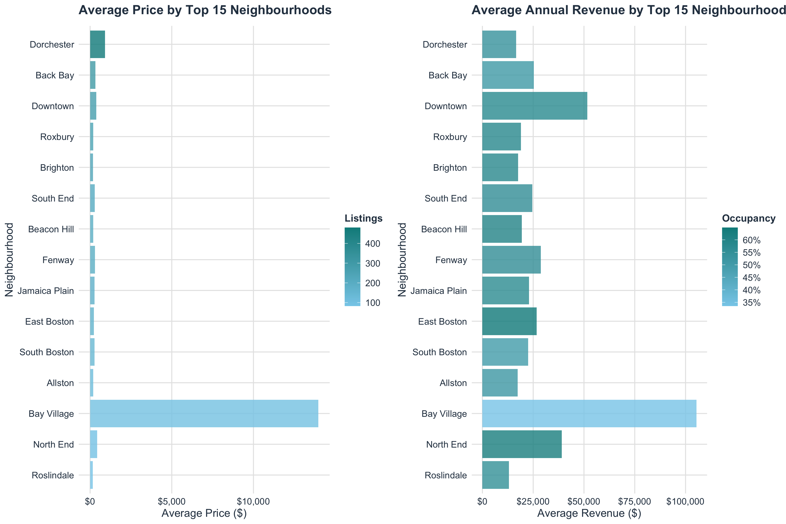

**Observations:**

- ***Bay Village*** shows higher average prices and revenues than
  others, while many high-listing neighborhoods like ***Dorchester***
  have moderate prices and lower revenue per listing.
- ***Downtown*** has relatively higher revenues and occupancy.
- Occupancy shading: some mid‑priced neighborhoods achieve relatively
  high revenue because they balance solid prices with healthy occupancy
  rates.

**Interpretations:** Bay Village seems to be an outlier with insanely
high average price. Neighborhoods reflect optimal market positing if
they can balance price and demand (e.g., Downtown). Some neighborhoods
represent an undervalued market opportunity where lower competition
allows consistent bookings (e.g., Dorchester).

**Recommendations:** New hosts should consider emerging neighborhoods
like Dorchester and Roxbury where lower entry prices enable competitive
positioning. Current hosts may consider obtaining more listings in these
neighborhoods.

### 3.5 Pricing Strategy Analysis

To build a comprehensive pricing narrative, we plot the following
graphs: a fundamental price-revenue relationship, elasticity dynamics to
show sensitivity, and a heatmap showing optimal price-occupancy
combinations.

#### 3.5.1. Revenue per Available Night vs Price

We use a scatter plot to explore out hypothesis of diminishing returns
of higher nightly rates.

**Observations:**

- The curve shows ***strong positive correlation*** between price and
  revenue per available night up to approximately \$500, then flattens
  considerably, confirming ***diminishing returns of higher nightly
  rates***.
- Maximum efficiency concentrations occur in the \$100-\$300 range where
  a significant amount of properties achieve \$200-\$600 per available
  night.

**Interpretations:** Moderate price increases significantly boost
revenue efficiency, but extreme pricing faces demand constraints, which
is consistent with our previous findings. The plateau above \$500
reflects limited luxury market depth in Boston.

**Recommendations:** Hosts currently priced below \$200 can test
strategic rate increases, as the steep curve section indicates
substantial revenue upside. Mid-range hosts (\$200-\$400) should
implement dynamic pricing to capture demand fluctuations. Properties
above \$500 should focus on occupancy optimization through enhanced
marketing towards targeted demographics rather than further rate
increases.

#### 3.5.2. Revenue Elasticity Charts (Price & Occupancy)

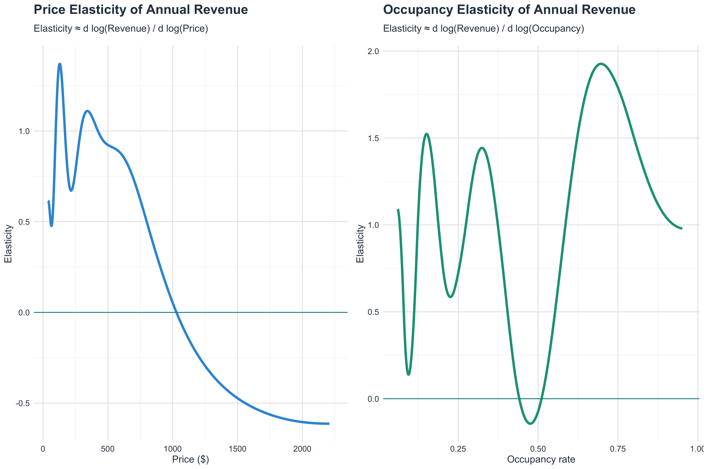

**Observations:**

- Revenue is only mildly sensitive to price at beyond low starting
  prices.
- Occupancy elasticity displays high volatility with dramatic peaks
  around 15-20% occupancy rates, then stabilizes significantly above 40%
  occupancy.

**Interpretations:** Budget travelers seem to be highly responsive to
small prove changes, and luxury guests are relatively price-insensitive.
Premium positioning reduces price competition pressure, but it is more
difficult to afford, maintain, and attract customers for these listings.
The occupancy elasticity pattern suggests revenue stability above a
certain occupancy threshold (40%+). Very low occupancy creates
unpredictable revenue swings.

**Recommendations:** Budget-conscious hosts (\<\$150/night) must monitor
competitive pricing closely as small changes significantly impact
demand. Premium hosts can maintain stable pricing knowing their target
market tolerates rate variations. All hosts should prioritize
maintaining 40%+ occupancy through strategic and seasonal adjustments
rather than accepting extreme low-occupancy periods.

### 3.6 Operational Optimization

We want to address controllable operational decisions. We want to answer
the questions “What should I offer?” and “What booking policies should I
set?” to provide actionable tactics that hosts can implement
immediately.

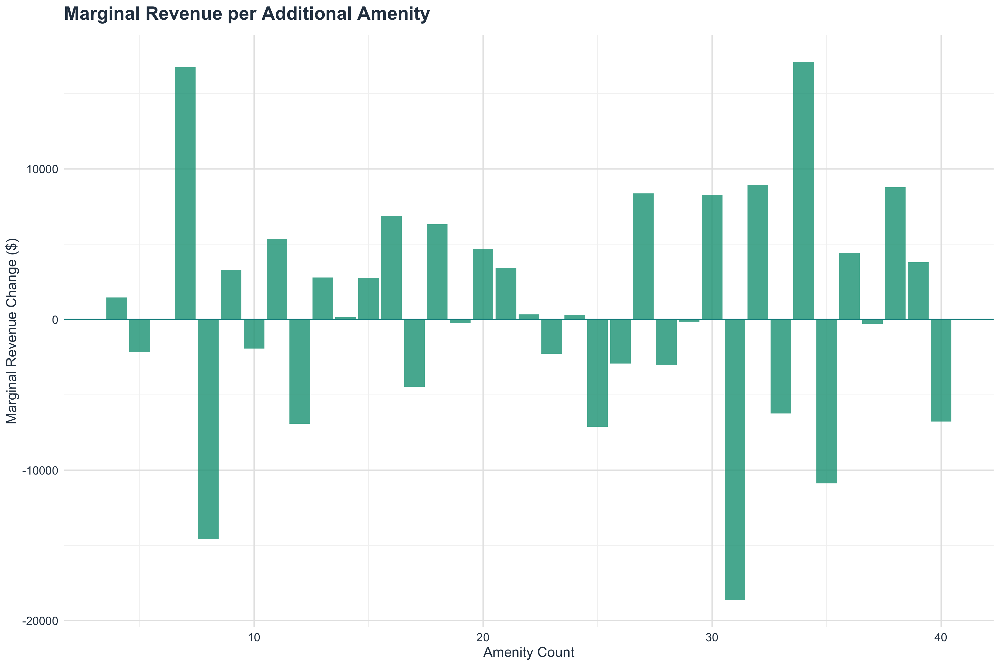

**Observations** Some amenity-count increases correlate with sizeable
positive revenue jumps, while others coincide with negligible or even
negative changes, suggesting highly uneven returns.

**Interpretations:** Quality over quantity matter—strategic amenity
selection outperforms indiscriminate additions. Negative marginal
returns at certain counts likely reflect cost burdens exceeding guest
willingness to pay or maintenance complexities reducing listing
availability.

**Recommendations:** Hosts should focus on high-impact amenities aligned
with target guest profiles rather than maximizing amenity count. For
premium listings, curated comprehensive amenity packages can justify
significant rate premiums.

### 3.7 Host Development Insights

We want to conclude this analysis section by exploring the assumptions
about host experience. We plot the following chart to see whether tenure
or execution matters more.

**Observations:**

- The trend line surprisingly shows declining revenue as host experience
  increases beyond 5 years.
- The 4-6 year range showing peak revenue concentration just under
  \$50,000.
- Significant outliers exist at all experience levels, with some hosts
  earning \$200,000+ regardless of tenure.

**Interpretations:** The negative correlation suggests experienced hosts
may face complacency, outdated pricing strategies, or increased
competition eroding earlier advantages. Peak performance at 4-6 years
indicates an optimal balance between operational expertise and market
adaptability. The wide dispersion demonstrates that individual host
strategies matter more than experience alone.

**Recommendations:** Veteran hosts must actively refresh their approach,
adopting dynamic pricing tools and modernizing listings to compete with
newer, more aggressively managed properties. Success requires ongoing
adaptation, not just experience. New hosts should leverage automation
and data-driven pricing from day one. All hosts should benchmark against
top performers regardless of experience level.

## Modeling: Clustering

To determine the appropriate number of clusters for the segmentation
analysis, we evaluated two diagnostic methods: the Elbow Method and the
Silhouette Method.

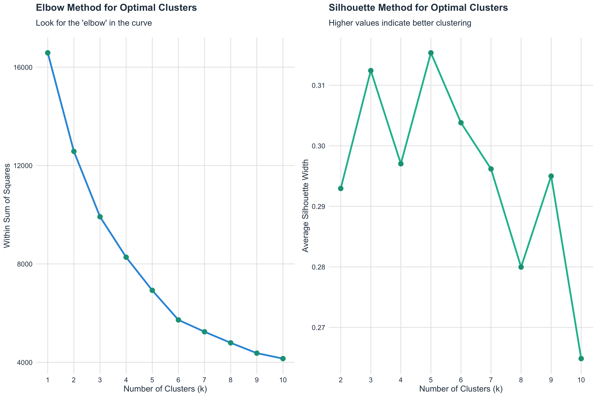

The Elbow Method plot shows a steep decline in within-cluster sum of
squares (WSS) from k = 1 to k = 3, followed by a more gradual decrease.
The curve begins to flatten around k = 4 to k=5, indicating diminishing
returns in cluster compactness beyond this point. However, still there
is not an apparent elbow that would indicate the best number of
clusters. The Silhouette Method, which measures how well-separated and
well-structured the clusters are, shows a peak silhouette score around k
= 5, with values decreasing for larger k. In this case, the diagnostic
indicates an optimal k=5 for a balanced clustering. This value was
therefore selected for the final clustering solution used throughout the
analysis. As a result, the final clustering solution identified five
meaningful segments:

- **Luxury Hotel Cluster**
- **Amenity-Rich Large Homes**
- **Standard Mid-Tier Homes**
- **Underperforming Units**
- **Low-Demand Homes**

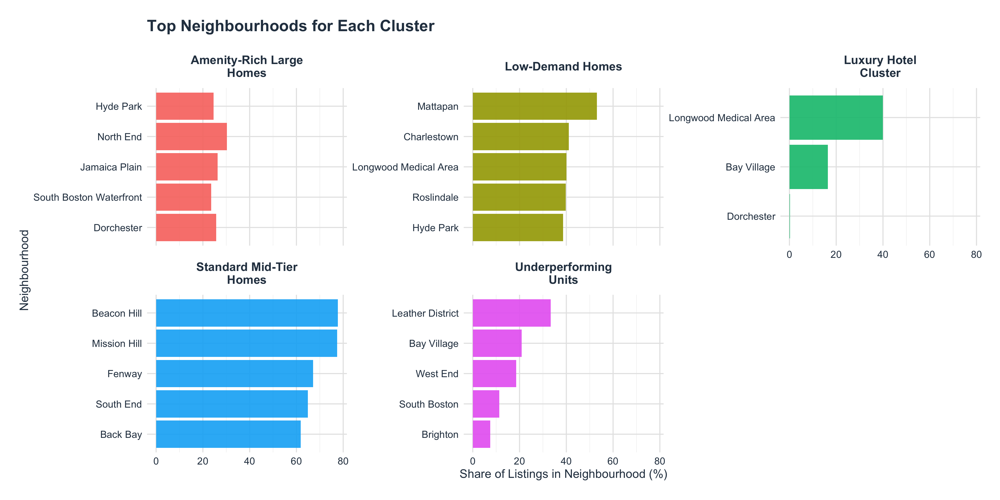

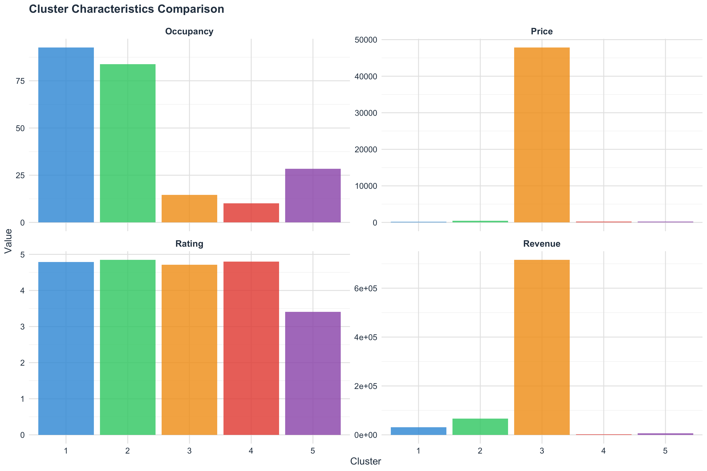

The Luxury Hotel Cluster represents a very small set of ultra-luxury,
high-revenue listings that behave fundamentally differently from the
rest of the Boston market. Their uniformly high review scores and large
guest capacity suggest that they are not typical home-share listings but
likely correspond to hotel penthouses, luxury suites, or commercial
group accommodations that also appear on Airbnb. Standard Mid-Tier Home
cluster show an overall high Airbnb activity and consistent demand for
moderate-priced, well-reviewed units. In contrast, Amenity-Rich Large
Homes cluster offers larger housing stock and attracts groups, families,
and visitors seeking upgraded amenities or extended stays. Low-Demand
Homes tend to have a weaker performance and are concentrated in
Mattapan, Charleswood areas, far from the city center. listing
performance tends to be weaker. Underperforming Units cluster in the
Leather District, Bay Village, the West End, and parts of South Boston,
reflecting small sections of low-occupancy or lower-rated listings even
within high-demand regions. Overall, the plot demonstrates that each
cluster aligns with meaningful spatial and economic patterns.

## Results and Recommendations

Our results point to a few clear takeaways for improving listing
performance. Superhosts consistently perform better than regular hosts,
which suggests that working toward Superhost status can meaningfully
improve revenue outcomes, especially by maintaining fast and reliable
response rates.

Looking across room types, property types, amenities, and neighbourhood
trends gives a clearer picture of what drives guest satisfaction in
Boston. Entire homes, especially condos and townhouses, tend to deliver
higher value scores, likely because they offer more privacy and built-in
amenities that guests appreciate. At the neighbourhood level, areas like
East Boston and Downtown consistently show strong guest engagement and
high review activity, while places like Dorchester appear more
saturated, with lots of listings but comparatively low guest
interaction. Beacon Hill and Downtown also score highest on location
satisfaction, which is something guests pay close attention to when
booking.

For prospective hosts, the data suggests a few clear strategies:
prioritize listing in neighbourhoods with strong demand and high
location scores, especially Downtown, East Boston, or Beacon Hill, and
consider offering entire homes or property types with many amenities,
like condos or townhouses. These choices not only align with guest
preferences but also increase visibility, improve ratings, and create
better long-term returns.

Finally, revenue is more strongly driven by occupancy than by price
alone. Rather than focusing only on raising nightly rates, hosts are
likely to see better results by using strategies that keep listings
booked, such as adjusting prices during low-demand periods, improving
listing visibility, and optimizing stay requirements.

## Team Contributions

- Nare Abgaryan
  - Price Analysis
  - Clustering
- Gia Bao (Belinda) Ngo
  - Revenue Analysis
  - Results & Recommendations
- Prajusha Reddy
  - Property Analysis
  - Results & Recommendations
- Urvi Sharma
  - Introduction
  - Host Analysis
  - Results & Recommendations
